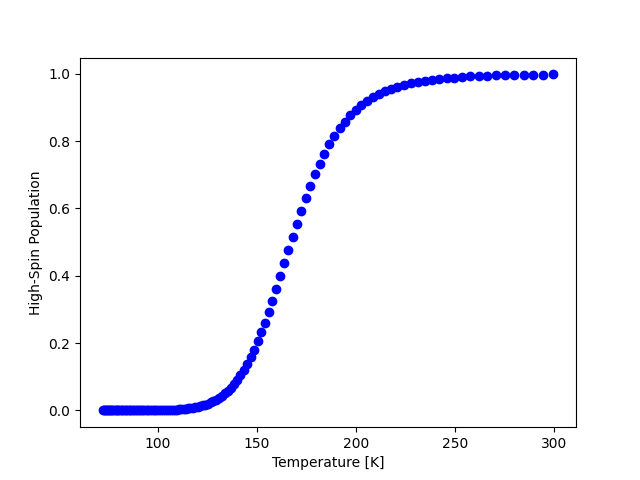
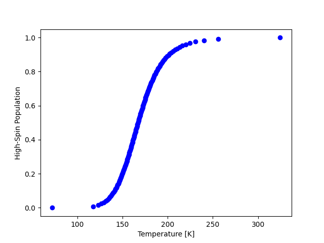
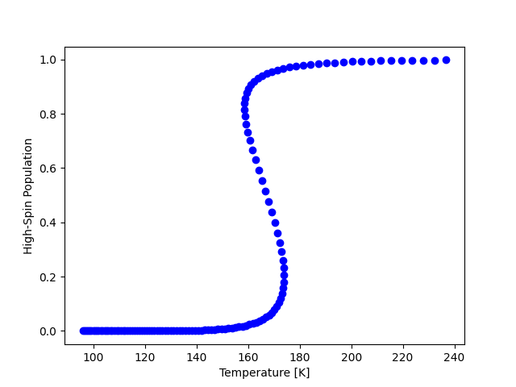
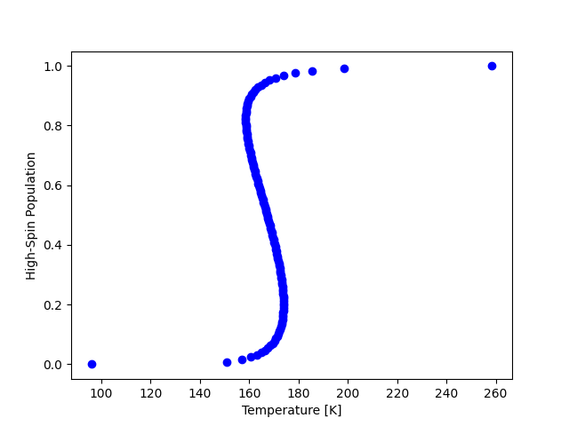

<p align="center">
   
</p>

**Notice** The Electronic Supplementary Material for [J. Phys. Chem. A](https://doi.org/10.1021/acs.jpca.5c05841) **129**,11032-11040 (2025) has been relocated to [this public repository](https://github.com/amalbavera/Fe_tBu2qsal_2) in an effort to keep the development of the pySCO library independent from those files.

Please ensure that the following external libraries are installed beforehand:

- [NumPy](https://numpy.org/)
- [SciPy](https://scipy.org/)

We use the [International System of Units](https://www.nist.gov/pml/owm/metric-si/si-units) as follows:

| Property              | Symbol                    | Unit                              |
| :-------------------: | :-----------------------: | :-------------------------------: |
| Temperature           | $T$                       | K                                 |
| Spin-Crossover Energy | ${\Delta E}_\mathrm{sco}$ | kJ mol<sup>-1</sup>               |
| Enthalpy Change       | $\Delta H$                | kJ mol<sup>-1</sup>               |
| Entropy Change        | $\Delta S$                | J mol<sup>-1</sup> K<sup>-1</sup> |
| Gibbs Free Energy     | $G$                       | kJ mol<sup>-1</sup>               |
| Interaction Parameter | $\Gamma$                  | kJ mol<sup>-1</sup>               |
| High-Spin Population  | $n_\mathrm{HS}$           | $0 \leq n_\mathrm{HS} \leq 1$     |

# Table of Contents

1. [Reading Outputs from Electronic Structure Codes](#1-reading-outputs-from-electronic-structure-codes)
    1. [Materials Modeling](#11-materials-modeling)
        1. [VASP](#111-vasp)
    2. [Quantum Chemistry](#12-quantum-chemistry)
        1. [Gaussian](#121-gaussian)
        2. [ORCA](#122-orca)
        3. [NWChem](#123-nwchem)
        4. [pySCF](#124-pyscf)
    3. [Passing Additional Options](#13-passing-additional-options)
        1. [Jahn-Teller Distortion](#131-jahn-teller-distortion)
        2. [Orbital Angular Momentum](#132-orbital-angular-momentum)
        3. [Spin Configurations](#133-spin-configurations)
    4. [Setting Additional Properties](#14-setting-additional-properties)
        1. [Spin per Atom](#141-spin-per-atom)
        2. [Orbital Angular Momentum](#142-orbital-angular-momentum)
    5. [Custom Spin State](#15-custom-spin-state)
2. [Thermodynamic models](#2-thermodynamic-models)
    1. [Regular Solution](#21-regular-solution)
        1. [Setting Additional Properties](#211-setting-additional-properties)
            1. [Spin Population Thresholds](#2111-spin-population-thresholds)
            2. [Spin Population Points](#2112-spin-population-points)
        2. [Spin-Crossover Energy](#212-spin-crossover-energy)
        3. [Transition Temperature](#213-transition-temperature)
        4. [High-Spin Population as function of Temperature](#214-high-spin-population-as-function-of-temperature)
        5. [Gibbs Free Energy as Function of Temperature](#215-gibbs-free-energy-as-function-of-temperature)
    2. [Slichter Drickamer](#22-slichter-drickamer)
        1. [Setting Additional Properties](#221-setting-additional-properties)
            1. [Spin Population Thresholds](#2211-spin-population-thresholds)
            2. [Spin Population Points](#2212-spin-population-points)
            3. [Interaction Parameter](#2213-interaction-parameter)
        2. [Spin-Crossover Energy](#222-spin-crossover-energy)
        3. [Transition Temperature](#223-transition-temperature)
        4. [High-Spin Population as function of Temperature](#224-high-spin-population-as-function-of-temperature)
        5. [Gibbs Free Energy as Function of Temperature](#225-gibbs-free-energy-as-function-of-temperature)
        6. [Fitting an Interaction Parameter](#226-fitting-an-interaction-parameter)
            1. [Least Squares](#2261-least-squares)
            2. [Boltzmann Ensemble](#2262-boltzmann-ensemble)

---

# 1. Reading Outputs from Electronic Structure Codes

The library currently is compatible with [VASP](#111-vasp), [Gaussian](#121-gaussian), [ORCA](#122-orca), [NWChem](#123-nwchem), and [pySCF](#124-pyscf).

## 1.1 Materials Modeling

### 1.1.1 VASP

Since VASP produces several output files, each collecting different data, we need to locate the folder with the outputs and pass it to pySCO. Before proceeding any further, please keep in mind that this is a three-step process, namely,

1. relax the geometry using a $k$-point mesh,
2. run a single-point energy calculation with a $k$-point mesh, and
3. compute the vibrational frequencies with a $q$-point mesh.

Here we are interested in the EIGENVAL, POSCAR, and OUTCAR files from step (2), and in the OUTCAR file from step (3). There are two additional files we need to prepare for every spin state, namely, MAGCAR and VIBCAR. The first one simply contains the analogous magnetization as reported in the OUTCAR from step (2), but with the correct rounded magnetic moments, e.g.

```text

 magnetization (x)

# of ion       s       p       d       tot
------------------------------------------
    1        0.000   0.000   4.000   4.000
    2        0.000   0.000   4.000   4.000
    3        0.000   0.000   0.000   0.000
    ...
  256        0.000   0.000   0.000   0.000
--------------------------------------------------
tot          0.000   0.000   8.000   8.000
```

where the first two atoms are assigned four unpair electrons each, whereas the rest show no magnetic moment. The second file, VIBCAR, is the OUTCAR that contains the harmonic vibrational frequencies computed with the chosen set of $q$-points in step (3). We can either rename the original OUTCAR file from step (3) to VIBCAR, or save time by running the following command from the console

```bash
grep 2PiTHz OUTCAR > VIBCAR
```

Now we can pass the location to the directory that contains the OUTCAR, EIGENVAL, POSCAR, MAGCAR, and VIBCAR files. Remember that we need to do this for each spin state.

```python
import pysco

low_spin  = pysco.read_vasp( 'path/to/the/low/spin/state/directory' )
high_spin = pysco.read_vasp( 'path/to/the/high/spin/state/directory' )
```

---

## 1.2 Quantum Chemistry

There are several approaches to generate the output files. The most straightforward is to run a geometry relaxation followed by a frequency analysis in the same job. However, this usually is discuraged by most exprienced users and, instead, a two-step approach is preferred, where we first do the geometry relaxation and then, on a separate run, compute the frequency analysis. Here we will favor this second approach and hence the output of interest is that for the frequency analysis.

The file extension for the electronic structure codes [Gaussian](#121-gaussian), [ORCA](#122-orca), and [NWChem](#123-nwchem), in particular, is irrelevant for as long as you include the complete file name.

### 1.2.1 Gaussian

```python
import pysco

low_spin  = pysco.read_gaussian( 'path/to/the/low/spin/state/gaussian/output.log' )
high_spin = pysco.read_gaussian( 'path/to/the/high/spin/state/gaussian/output.log' )
```

### 1.2.2 ORCA

```python
import pysco

low_spin  = pysco.read_orca( 'path/to/the/low/spin/state/orca/output.out' )
high_spin = pysco.read_orca( 'path/to/the/high/spin/state/orca/output.out' )
```

**Advise to the user**: ORCA sometimes truncates the number of molecular orbitals written in the output, which is not helpful in our case, therefore including `! PrintMOs` in your input ensures that all orbitals are printed.

### 1.2.3 NWChem

```python
import pysco

low_spin  = pysco.read_nwchem( 'path/to/the/low/spin/state/nwchem/output.out' )
high_spin = pysco.read_nwchem( 'path/to/the/high/spin/state/nwchem/output.out' )
```

### 1.2.4 pySCF
Since pySCF already runs in Python, we simply need to provide the mean-field object we created for our run, and the harmonic analysis dictionary that we obtained from the hessian matrix. For the sake of clarity, please keep in mind that the mean-field object commonly is referred to as `mf` in the pySCF documentation, whereas the harmonic analysis is available through the `thermo` module using

```python
from pyscf.hessian import thermo

hessian = spin_state_mean_field_object.Hessian( ).kernel( )
spin_state_harmonic_analysis = thermo.harmonic_analysis( spin_state_mean_field_object.mol, hessian )
```

Then we use those outputs from our generic example in pySCO as follows,

```python
import pysco

low_spin  = pysco.read_pyscf( low_spin_mean_field_object, low_spin_harmonic_analysis )
high_spin = pysco.read_pyscf( high_spin_mean_field_object, high_spin_harmonic_analysis )
```

---

## 1.3 Passing Additional Options
The [read](#1-reading-outputs-from-electronic-structure-codes) module also allows for the inclusion of additional options when reading output files. These are specified as keyword arguments, namely, [jahnteller](#131-jahn-teller-distortion), [orbit](#132-orbital-angular-momentum), and [configs](#133-spin-configurations). These keywords are not mutually exclusive and hence may be included simultaneously.

### 1.3.1 Jahn-Teller Distortion

`jahnteller:int = 1`. By default pySCO assumes no Jahn-Teller distortions. The argument `jahnteller` may be used to specify the number of distortions in the structure. The following is an example using the [Gaussian](#121-gaussian) reader,

```python
import pysco

low_spin  = pysco.read_gaussian( 'path/to/the/low/spin/state/output.log',  jahnteller=1 )
high_spin = pysco.read_gaussian( 'path/to/the/high/spin/state/output.log', jahnteller=3 )
```

### 1.3.2 Orbital Angular Momentum

`orbit:int = 0`. By default pySCO assumes no spin-orbit coupling. The argument `orbit` may be used to specify the orbital angular momentum, $L$, to compute the entropic contribution $`{\Delta S}_\mathrm{orb}`$ in the form

```math
{\Delta S}_\mathrm{orb} = k_B\,N_A\,\ln\left[ \frac{2\,L_\mathrm{HS} + 1}{2\,L_\mathrm{LS} + 1} \right]
```

where LS and HS label the low- and high-spin state, respectively. The following is an example using the [NWChem](#123-nwchem) reader,

```python
import pysco import

low_spin  = pysco.read_nwchem( 'path/to/the/low/spin/state/output.out',  orbit=1 )
high_spin = pysco.read_nwchem( 'path/to/the/high/spin/state/output.out', orbit=3 )
```

### 1.3.3 Spin Configurations

`configs:int = 1`. By default pySCO assumes a unique spin configuration. But for the cases where a given spin state may exhibit more that one spin configuration related by symmetry, we use `configs` to specify the total number of such configurations, $`N_\mathrm{conf}`$, so that pySCO computes the associated entropic contribution given by

```math
{S}_\mathrm{conf} = k_B\,N_A\,\ln\left[ N_\mathrm{conf} \right]
```

The following is an example using the [Gaussian](#121-gaussian) reader,

```python
import pysco import

low_spin  = pysco.read_gaussian( 'path/to/the/low/spin/state/output.out',  configs=1 )
high_spin = pysco.read_gaussian( 'path/to/the/high/spin/state/output.out', configs=2 )
```
---

## 1.4 Setting Additional Properties

### 1.4.1 Spin per Atom

`set_spin(list[int])`. Here we refer to spin, $`\zeta`$, as the difference between spin-up electrons, $`N_\uparrow`$, and spin-down electrons, $`N_\downarrow`$. Hence, $`\zeta = N_\uparrow - N_\downarrow`$. By default, pySCO will search for the multiplicity to determine the spin and assign it to any Cr, Mn, Fe, or Co in the structure. This choice certainly is convenient for mononuclear metal complexes, but needs to be handled properly for multicenter systems. The `set_spin()` property can therefore be used to override the default behavior and specify the desired spin for each metal center, or any other atom in particular.

- It is a list of integers with the same size as the total number of atoms in the metal-complex. 
- The order of the elements in this list must be consistent with the ordering of the atoms in the geometry.

The following is an example using the [Orca](#122-orca) reader,

```python
import pysco

low_spin  = pysco.read_orca( 'path/to/the/low/spin/state/output.out' )
high_spin = pysco.read_orca( 'path/to/the/high/spin/state/output.out' )

low_spin.set_spin(  2*[5] + 98*[0] )
high_spin.set_spin( 2*[1] + 98*[0] )
```

It is important to note that we do not need the `set_spin` atribute for [VASP](#111-vasp) because we already provide the MAGCAR. Keep in mind that pySCO will overwrite the contents read from MAGCAR should `set_spin` be specified.

### 1.4.2 Orbital Angular Momentum

`set_orbit(list[int])`. Specify the orbital angular momentum per atom from a predifined list.

- It is a list of integers with the same size as the total number of atoms in the metal-complex. 
- The order of the elements in this list must be consistent with the ordering of the atoms in the geometry.

The following is an example using the [NWChem](#123-nwchem) reader,

```python
import pysco

low_spin  = pysco.read_nwchem( 'path/to/the/low/spin/state/output.out' )
high_spin = pysco.read_nwchem( 'path/to/the/high/spin/state/output.out' )

low_spin.set_orbit(  2*[1] + 98*[0] )
high_spin.set_orbit( 2*[3] + 98*[0] )
```

---

## 1.5 Custom Spin State

The library offers the possibility to define a spin state independent of an ouput file, or files, from electronic structure calculations. This is handy for toy problems or for more in-depth analyses. The following list gathers all the necessary attributes for such purpose.

- `elements:list[str]`. No units. All the elements for the species at hand. It is possible to use a short-hand notation to group the elements, e. g., `['Mn'] + ['C'] + ['H']`.

- `atoms:list[int]`. No units. Atom counts for the species at hand. Use of a short-hand notation is possible, e. g., `[1] + [12] + [14]`.

- `spin:list[int]`. No units. Difference between spin-up electrons and spin-down electrons on a per atoms basis. The ordering must be consitent with the attribute `elements`. A short-hand notation also is possible for this attribute, e. g., `[5] + 12*[0] + 14*[0]`.

- `energy:float`. In units of electronvolt. The self-consistent total energy of the species for the spin state at hand.

- `volume:float`. In units of $`\mathring A`$<sup>3</sup>. The volume for the unit cell for species with periodic boundary conditions and zero otherwise.

- `frequencies:list[float]`. In units of Hertz. The set of harmonic frequencies for the species at hand. Beware that by setting this atribute to zeros, e. g., `3*[0.0]` the library will ignore all the vibrational contributions for the calculation of both spin-crossover energies and temperatures.

- `orbital_energies:list[float]`. In units of electronvolt. Single particle energies subtracted by the Fermi energy for the species at hand.

- `rotational_symmetry:float`. No units. The rotational symmetry number for the species at hand. Given that the use of symmetry most often is not utilized, the rotational symmetry number likely is one. Beware that by setting this attribute to zero, the library will ignore the contributions to the rotational entropy.

- `rotational_temperature:float`. In units of Kelvin. The rotational temperature for the species at hand. It is defined as $`\theta_r = \hbar/(2\,k_B\,I)`$, where $`I`$ is the moment of inertia for the species. Beware that by setting this attribute to zero, the library will ignore the contributions to the rotational entropy.

The definition of a custom spin state also allows for the inclusion of additional options that are specified as keyword arguments, namely, [jahnteller](#131-jahn-teller-distortion) and [configs](#133-spin-configurations). These keywords are not mutually exclusive and hence may be included simultaneously. The orbital angular momentum, [orbit](#132-orbital-angular-momentum), on the other hand, must be set as in the following example,  that further illustrates the use of the [configs](#133-spin-configurations) option during the creation of the generic `spin_state` object.

```python
import pysco

spin_state = pysco.read.reader( configs=1 )

spin_state.elements = ['Fe'] + ['O']  + ['N']   + ['C']    + ['H']
spin_state.atoms    = [4]    + [8]    + [16]    + [192]    + [216]
spin_state.spin     =  4*[4] +  8*[0] +  16*[0] +  192*[0] +  216*[0]

spin_state.energy   = -2749.21532786
spin_state.volume   = 4699.15

spin_state.frequencies      = [ 3.329835e+13, 3.328946e+13, ..., 5.569565e+12, 5.566312e+12 ]
spin_state.orbital_energies = [ -89.566276, -89.566270, ..., 6.221009,   6.240796 ]

spin_state.rotational_symmetry    = 0.0 # Ignore contribution
spin_state.rotational_temperature = 0.0 # Ignore contribution

# IMPORTANT: Set internal variables
spin_state.orbit             = spin_state._set_orbital_momentum( 0 )
spin_state.zero_point_energy = spin_state._set_zero_point_energy( )

# IMPORTANT: Sanity check
spin_state._check_attributes( )
```

---

# 2. Thermodynamic models

## 2.1 Regular Solution

This model consists of assuming that the spin state mixture for a given molecular aggregate is  distributed statistically and forms a regular solution. For a given material at constant pressure, the conversion from low to high spin is a thermal equilibrium between the spin configurations. The state function therefore is the Gibbs free energy $`G = H - T\,S`$, where $`H`$ and $`S`$ label the enthalpy and entropy for the system, respectively. If we now consider a set of $`N`$ weakly interacting molecules of which $`N_\mathrm{HS}`$ are in the high-spin state at temperature $`T`$, then the relative high-spin fraction is $`n_\mathrm{HS} = N_\mathrm{HS}/N`$, in terms of which the Gibbs free energy of an ideal solution model that includes the Gibbs free energy of the individual molecular spin states is

```math
G = n_\mathrm{HS}\,G_\mathrm{HS} + (1 - n_\mathrm{HS})\,G_\mathrm{LS} - T\, S_\mathrm{mix} \, .
```

Where the basic assumption is that the inter-molecular coupling has negligible dependence on those spin states, and that the ideal entropy of mixing, $`S_\mathrm{mix}`$, in the thermodynamic limit is

```math
S_\mathrm{mix} = -k_B\,N_A\,(\; n_\mathrm{HS} \ln[n_\mathrm{HS}] + (1 - n_\mathrm{HS}) \ln[1 - n_\mathrm{HS}] \;)\, ,
```

where $`N_A`$ and $`k_B`$ are Avogadro's number and Boltzmann's constant, respectively.

There are two optional arguments that modify the behavior of the model:

- `metals:tuple(str) = ('Cr', 'Mn', 'Fe', 'Co)`. By default the reported spin-crossover energy is normalized to the total number of spin conversion centers. This number is determined internally by comparing which transition metals undergo a spin transition. This list of metals can be modified by the user.

- `centers:float = 1.0`. The automatic normalization also may be overruled by means of this optional keyword that fixes the total number of spin-crossover centers. This is useful for multi-center metal complexes were not all metals switch their spin state. Alternatively, the use of [set_spin](#141-spin-per-atom) also fixes internally the number of spin-crossover centers.

We may use this regular solution model in pySCO by creating an object which, for practical purposes we will be calling `model`, in the form

```python
import pysco

# Default use
model = pysco.RegularSolution( ls=low_spin, hs=high_spin )

# Specify the metals of interest
model = pysco.RegularSolution( ls=low_spin, hs=high_spin, metals=('Fe') )

# Fix a different number of metallic centers
model = pysco.RegularSolution( ls=low_spin, hs=high_spin, centers=2.0 )

# Specify the local spins for both the low- and high-spin states

low_spin.set_spin(  [1, 0], 98*[0] )
high_spin.set_spin( [1, 2], 98*[0] )

model = pysco.RegularSolution( ls=low_spin, hs=high_spin)
```

where `low_spin` and `high_spin` are the objects we created previously by either [reading the output from an electronic structure code](#1-reading-outputs-from-electronic-structure-codes), or by including the information [ourselves](#15-custom-spin-state).

### 2.1.1 Setting Additional Properties

The regular solution model includes two main attributes that are accesible to the user:

- `min_nhs:float = 1.00e-06`. The lower bound for the relative high-spin population of interest. To prevent numerical inestabilities, the lower bound should not equal exactly zero.

- `max_nhs:float = 9.99e-01`. The upper bound for the relative high-spin population of interest. To prevent numerical inestabilities, the upper bound should not equal exactly one.

#### 2.1.1.1 Spin Population Thresholds

`set_min_nhs(float)`. Specify the lower bound for the relative high-spin population of interest.

- It is a float close to zero, but not exactly zero that helps preventing numerical inestabilities during the evaluation of the natural logarithm.

`set_max_nhs(float)`. Specify the upper bound for the relative high-spin population of interest.

- It is a float close to one, but not exactly one that helps preventing numerical inestabilities during the evaluation of the natural logarithm.

#### 2.1.1.2 Spin Population Points

The list of points for the [thermal evolution of the high-spin population](#214-high-spin-population-as-function-of-temperature) determined internally by pySCO is meant to produce a uniform sampling of the relative high-spin population to preserve the quality of the plot,

<p align="left">
   
</p>

`set_nhs_list:Callable`. It is possible to change the default uniform sampling by specifying a callable function with the positional arguments `points`, `min_nhs`, and `max_nhs`. The following code snipt exepmplifies its use with the [Gaussian](#121-gaussian) reader,

```python
import pysco

import numpy as np

from matplotlib import pyplot as plt

def mod_nhs_list( points, min_nhs, max_nhs ):
    
    nhs_points = np.linspace( min_nhs, max_nhs, num=points )

    return nhs_points

low_spin  = pysco.read_gaussian( 'path/to/the/low/spin/state/gaussian/output.log' )
high_spin = pysco.read_gaussian( 'path/to/the/high/spin/state/gaussian/output.log' )

model = pysco.RegularSolution( ls=low_spin, hs=high_spin )

# Specify the modified callable function
model.set_nhs_list = mod_nhs_list

nhs_T_dH_dS_dG = model.high_spin_population( )

plt.scatter( nhs_T_dH_dS_dG['T'], nhs_T_dH_dS_dG['nhs'], c='b' )

plt.xlabel( 'Temperature [K]' )
plt.ylabel( 'High-Spin Population' )

plt.show( )
```

that produces the following result

<p align="left">
   
</p>

---

### 2.1.2 Spin-Crossover Energy

The energy difference between the high-spin and low-spin states, $`{E}_\mathrm{HS}`$ and $`{E}_\mathrm{LS}`$, respectively, plus the zero-point energy correction, $`{\Delta E}_\mathrm{zpe}`$, defines the spin-crossover energy as

```math
{\Delta E}_\mathrm{sco} = {\Delta E}_\mathrm{HL} + {\Delta E}_\mathrm{zpe}\, ,
```

where $`{\Delta E}_\mathrm{HL} = {E}_\mathrm{HS} - {E}_\mathrm{LS}`$ is the total energy difference between the high- and low-spin states.

There is one optional argument that modifies the behavior of the function:

- `zero_point_energy:bool = False`. If set to `True`, the zero-point energy correction will be included, as in $`{\Delta E}_\mathrm{sco}`$. Otherwise the energy difference $`{\Delta E}_\mathrm{HL}`$ will be reported.

```python
import pysco

# Default
Ehl  = model.spin_crossover_energy( )

# Include the zero-point energy correction
Esco = model.spin_crossover_energy( zero_point_energy=True )

```

### 2.1.3 Transition Temperature

The equilibrium temperature at which the populations of the high-spin and low-spin states are equal defines the transition temperature, $`T_{1/2}`$ as 

```math
T_{1/2} = \frac{\Delta H}{\Delta S}\, ,
```

where $`\Delta H`$ and $`\Delta S`$ are the changes in enthalpy and entropy between, respectively.

There are two optional arguments that modify the behavior of the function:

- `guess:float = 298.15`. A rough estimate of $`T_{1/2}`$, in Kelvin, can be provided to accelerate the numerical procedure.

- `tol:float = 1.0e-03`. The accuracy threshold for the calculation of $`T_{1/2}`$.

```python
import pysco

# Default
Thalf, dH, dS = model.transition_temperature( )

# Modify the initial temperature guess
Thalf, dH, dS = model.transition_temperature( guess=120.0 )

# Modify the convergence threshold for the temperature
Thalf, dH, dS = model.transition_temperature( tol=0.01 )

# Simultaneous choices
Thalf, dH, dS = model.transition_temperature( guess=120.0, tol=0.01 )
```

### 2.1.4 High-Spin Population as Function of Temperature

Compute the thermal evolution of the relative high-spin population, also known as magnetization, in the form

```math
\Delta H = T\, \Delta S + k_B\,N_A \ln\left[ (1 - n_\mathrm{HS})/n_\mathrm{HS} \right]\, .
```

Returns `dict[str:ndarray]`, a dictionary with NumPy arrays with keys 'nhs': relative high-spin population, 'T': temperature, 'dH': change in enthalpy, 'dS': change in entropy, 'dG': change in Gibbs free enrgy.

There are three optional arguments that modify the behavior of the function:

- `points:int = 128`. The number of temperature points at which the high-spin population will be evaluated.

- `guess:float = 298.15`. The initial temperature guess, in Kelvin, for the numerical procedure.

- `tol:float = 1.0e-03`. The accuracy threshold for the calculation of the temperatures.

```python
import pysco

# Default
nhs_T_dH_dS_dG = model.high_spin_population( )

# Modify the number of points
nhs_T_dH_dS_dG = model.high_spin_population( points=512 )

# Modify the initial temperature guess
nhs_T_dH_dS_dG = model.high_spin_population( guess=120.0 )

# Modify the convergence threshold
nhs_T_dH_dS_dG = model.high_spin_population( tol=0.01 )

# Simultaneous choices
nhs_T_dH_dS_dG = model.high_spin_population( points=512, guess=120.0, tol=0.01 )
```

### 2.1.5 Gibbs Free Energy as Function of Temperature

Compute the Gibbs free energy for a given isotherm in the form

```math
G = n_\mathrm{HS}\,G_\mathrm{HS} + (1 - n_\mathrm{HS})\,G_\mathrm{LS} - T\, S_\mathrm{mix} \, .
```

Returns `dict[str:ndarray]`, a NumPy array with keys 'nhs': relative high-spin population, 'dG': change in Gibbs free energy.

There is a single mandatory argument:

- `temperature:float`. Specify the choice of temperature for the isotherm.

There is one optional argument that modifies the behavior of the function:

- `points:int = 128`. The total number of point for the curve.

```python
import pysco

# Default
nHS_G = model.gibbs_free_energy( 120.0 )

# Modify the number of points
nHS_G = model.gibbs_free_energy( 120.0, points=512 )
```

---

## 2.2 Slichter Drickamer

[Slichter and Drickamer](https://doi.org/10.1063/1.1677511) proposed the addition of a non-linear mean-field term independent of the temperature to the regular solution model to parametrize the splitting in the form

```math
G = (1 - n_\mathrm{HS})\,G_\mathrm{LS} + n_\mathrm{HS}\,G_\mathrm{HS} + \Gamma\,n_\mathrm{HS}\,(1 - n_\mathrm{HS}) - T\,S_\mathrm{mix}\, .
```

That represents the simplest approximation to modeling inter-molecular interactions by means of a second-order term, $`\Gamma`$, that is independent of $`n_\mathrm{HS}`$ where LS and HS label the low- and high-spin state, respectively, and $`S_\mathrm{mix}`$ is the mixing entropy given by $`S_\mathrm{mix} = -k_B\,N_A\,(\; n_\mathrm{HS} \ln[n_\mathrm{HS}] + (1 - n_\mathrm{HS}) \ln[1 - n_\mathrm{HS}] \;)`$.

There are three optional arguments that modify the behavior of the model:

- `interaction:float = 0.0`. Define the phenomenological interaction parameter that will we used as the default during runtime evaluations. Use [set_interaction](#2213-interaction-parameter) to modify its value after the creation of the object.

- `metals:tuple(str) = ('Cr', 'Mn', 'Fe', 'Co)`. By default the reported spin-crossover energy is normalized to the total number of spin conversion centers. This number is determined internally by comparing which transition metals undergo a spin transition. This list of metals can be modified by the user.

- `centers:float = 1.0`. The automatic normalization also may be overruled by means of this optional keyword that fixes the total number of spin-crossover centers. This is useful for multi-center metal complexes were not all metals switch their spin state. Alternatively, the use of [set_spin](#141-spin-per-atom) also fixes internally the number of spin-crossover centers.

We may use the Slichter-Drickamer model in pySCO by creating an object which, for practical purposes we will be calling `model`, in the form

```python
import pysco

# Default use
model = pysco.SlichterDrickamer( ls=low_spin, hs=high_spin, interaction=2.0 )

# Specify the metals of interest
model = pysco.SlichterDrickamer( ls=low_spin, hs=high_spin, interaction=2.0, metals=('Fe') )

# Fix a different number of metallic centers
model = pysco.SlichterDrickamer( ls=low_spin, hs=high_spin, interaction=2.0, centers=2.0 )

# Specify the local spins for both the low- and high-spin states

low_spin.set_spin(  [1, 0], 98*[0] )
high_spin.set_spin( [1, 2], 98*[0] )

model = pysco.SlichterDrickamer( ls=low_spin, hs=high_spin )
```

where `low_spin` and `high_spin` are the objects we created previously by either [reading the output from an electronic structure code](#1-reading-outputs-from-electronic-structure-codes), or by including the information [ourselves](#15-custom-spin-state).

Keep in mind that by letting $`\Gamma = 0`$, the Slichter-Drickamer model reduces to the [Regular Solution](#21-regular-solution) model. If no interaction parameter is required, then we strongly recommend using the Regular Solution model instead for the sake of numerical stability. 

### 2.2.1 Setting Additional Properties

The Slichter-Drickamer model includes two main attributes that are accesible to the user:

- `min_nhs:float = 1.00e-06`. The lower bound for the relative high-spin population of interest. To prevent numerical inestabilities, the lower bound should not equal exactly zero.

- `max_nhs:float = 9.99e-01`. The upper bound for the relative high-spin population of interest. To prevent numerical inestabilities, the upper bound should not equal exactly one.

#### 2.2.1.1 Spin Population Thresholds

`set_min_nhs(float)`. Specify the lower bound for the relative high-spin population of interest.

- It is a float close to zero, but not exactly zero that helps preventing numerical inestabilities during the evaluation of the natural logarithm.

`set_max_nhs(float)`. Specify the upper bound for the relative high-spin population of interest.

- It is a float close to one, but not exactly one that helps preventing numerical inestabilities during the evaluation of the natural logarithm.

#### 2.2.1.2 Spin Population Points

The list of points for the [thermal evolution of the high-spin population](#224-high-spin-population-as-function-of-temperature) determined internally by pySCO is meant to produce a uniform sampling of the relative high-spin population to preserve the quality of the plot,

<p align="left">
   
</p>

`set_nhs_list:Callable`. It is possible to change the default uniform sampling by specifying a callable function with the positional arguments `points`, `min_nhs`, and `max_nhs`. The following code snipt exepmplifies its use with the [VASP](#111-vasp) reader,

```python
import pysco

import numpy as np

from matplotlib import pyplot as plt

def mod_nhs_list( points, min_nhs, max_nhs ):
    
    nhs_points = np.linspace( min_nhs, max_nhs, num=points )

    return nhs_points

low_spin  = pysco.read_vasp( 'path/to/the/low/spin/state/directory' )
high_spin = pysco.read_vasp( 'path/to/the/high/spin/state/directory' )

model = pysco.SlichterDrickamer( ls=low_spin, hs=high_spin, interaction=2.0 )

# Specify the modified callable function
model.set_nhs_list = mod_nhs_list

nhs_T_dH_dS_dG = model.high_spin_population( )

plt.scatter( nhs_T_dH_dS_dG['T'], nhs_T_dH_dS_dG['nhs'], c='b' )

plt.xlabel( 'Temperature [K]' )
plt.ylabel( 'High-Spin Population' )

plt.show( )
```

that produces the following result

<p align="left">
   
</p>

#### 2.2.1.3 Interaction Parameter

`set_interaction(float)`. Fix the default value for the phenomenological interaction parameter during runtime calculations. This value will be overruled should the optional argument [interaction](#22-slichter-drickamer) be used for the thermal evolution of [the high-spin population](#224-high-spin-population-as-function-of-temperature) or [the Gibbs free energy](#225-gibbs-free-energy-as-function-of-temperature). Likewise while [fitting an interaction parameter](#226-fitting-an-interaction-parameter).

---

### 2.2.2 Spin Crossover Energy

The energy difference between the high-spin and low-spin states, $`{E}_\mathrm{HS}`$ and $`{E}_\mathrm{LS}`$, respectively, plus the zero-point energy correction, $`{\Delta E}_\mathrm{zpe}`$, defines the spin-crossover energy as

```math
{\Delta E}_\mathrm{sco} = {\Delta E}_\mathrm{HL} + {\Delta E}_\mathrm{zpe}\, ,
```

where $`{\Delta E}_\mathrm{HL} = {E}_\mathrm{HS} - {E}_\mathrm{LS}`$ is the total energy difference between the high- and low-spin states.

There is one optional argument that modifies the behavior of the function:

- `zero_point_energy:bool = False`. If set to `True`, the zero-point energy correction will be included, as in $`{\Delta E}_\mathrm{sco}`$. Otherwise the energy difference $`{\Delta E}_\mathrm{HL}`$ will be reported.

```python
import pysco

# Default
Ehl  = model.spin_crossover_energy( )

# Include the zero-point energy correction
Esco = model.spin_crossover_energy( zero_point_energy=True )

```

### 2.2.3 Transition Temperature

The equilibrium temperature at which the populations of the high-spin and low-spin states are equal defines the transition temperature, $`T_{1/2}`$ as 

```math
T_{1/2} = \frac{\Delta H}{\Delta S}\, ,
```

where $`\Delta H`$ and $`\Delta S`$ are the changes in enthalpy and entropy between, respectively.

There are two optional arguments that modify the behavior of the function:

- `guess:float = 298.15`. A rough estimate of $`T_{1/2}`$, in Kelvin, can be provided to accelerate the numerical procedure.

- `tol:float = 1.0e-03`. The accuracy threshold for the calculation of $`T_{1/2}`$.

```python
import pysco

# Default
Thalf, dH, dS = model.transition_temperature( )

# Modify the initial temperature guess
Thalf, dH, dS = model.transition_temperature( guess=120.0 )

# Modify the convergence threshold for the temperature
Thalf, dH, dS = model.transition_temperature( tol=0.01 )

# Simultaneous choices
Thalf, dH, dS = model.transition_temperature( guess=120.0, tol=0.01 )
```

### 2.2.4 High-Spin Population as Function of Temperature

Compute the thermal evolution of the relative high-spin population, also known as magnetization, in the form

```math
\Delta H + \Gamma (1 - 2\,n_\mathrm{HS}) = T\, \Delta S + k_B\,N_A \ln\left[ (1 - n_\mathrm{HS})/n_\mathrm{HS} \right]\, .
```

Returns `dict[str:ndarray]`, a dictionary with NumPy arrays with keys 'nhs': relative high-spin population, 'T': temperature, 'dH': change in enthalpy, 'dS': change in entropy, 'dG': change in Gibbs free enrgy.

There are three optional arguments that modify the behavior of the function:

- `points:int = 128`. The number of temperature points at which the high-spin population will be evaluated.

- `guess:float = 298.15`. The initial temperature guess, in Kelvin, for the numerical procedure.

- `tol:float = 1.0e-03`. The accuracy threshold for the calculation of the temperatures.

- `interaction:float = None`. When povided, the temporary specified interaction parameter will be used on the fly. To fix an interaction parameter see [set_interaction](#2213-interaction-parameter).

```python
import pysco

# Default
nhs_T_dH_dS_dG = model.high_spin_population( )

# Modify the number of points
nhs_T_dH_dS_dG = model.high_spin_population( points=512 )

# Modify the initial temperature guess
nhs_T_dH_dS_dG = model.high_spin_population( guess=120.0 )

# Modify the convergence threshold
nhs_T_dH_dS_dG = model.high_spin_population( tol=0.01 )

# Use temporary interaction parameter
nhs_T_dH_dS_dG = model.high_spin_population( interaction=2.1 )

# Simultaneous choices
nhs_T_dH_dS_dG = model.high_spin_population( points=512, guess=120.0, tol=0.01, interaction=2.1 )
```

### 2.2.5 Gibbs Free Energy as Function of Temperature

Compute the Gibbs free energy for a given isotherm in the form

```math
G = n_\mathrm{HS}\,G_\mathrm{HS} + (1 - n_\mathrm{HS})\,G_\mathrm{LS} + \Gamma\,n_\mathrm{HS}\,(1 - n_\mathrm{HS}) - T\, S_\mathrm{mix} \, .
```

Returns `dict[str:ndarray]`, a NumPy array with keys 'nhs': relative high-spin population, 'dG': change in Gibbs free energy.

There is a single mandatory argument:

- `temperature:float`. Specify the choice of temperature for the isotherm.

There are two optional arguments that modify the behavior of the function:

- `points:int = 128`. The total number of point for the curve.

- `interaction:float = None`. When povided, the temporary specified interaction parameter will be used on the fly. To fix an interaction parameter see [set_interaction](#2213-interaction-parameter).

```python
import pysco

# Default
nHS_G = model.gibbs_free_energy( 120.0 )

# Modify the number of points
nHS_G = model.gibbs_free_energy( 120.0, points=512 )

# Use temporary interaction parameter
nHS_G = model.gibbs_free_energy( 120.0, interaction=2.1 )

# Simultaneous choices
nHS_G = model.gibbs_free_energy( 120.0, points=512, interaction=2.1 )

```

### 2.2.6 Fitting an Interaction Parameter

 Keep in mind that we need to sample a series of spin configurations within the interval $`0 < n_\mathrm{HS} < 1`$ to compute this interaction parameter. This set of spin configurations are passed to pySCO with the keyword `ms:list[reader]` that contains the objects generated by the [reader](#1-reading-outputs-from-electronic-structure-codes) modules.

 #### 2.2.6.1 Least Squares

 The fitting procedure will use a least-squares approach. It returns the interaction parameter and the coefficient of determination, $`R^2`$.

 There is a single mandatory argument:

 - `ms:list[reader]`. A list with the set of spin configurations that contains the objects generated by the [reader](#11-materials-modeling) modules for materials modeling.

 There are three optional arguments that modify the behavior of the function:

 - `guess:float = 298.15`. The initial temperature guess, in Kelvin, for the numerical procedure.

- `tol:float = 1.0e-03`. The accuracy threshold for the calculation of the temperatures.

- `interaction:float = None`. When povided, the temporary specified interaction parameter will be used on the fly. To fix an interaction parameter see [set_interaction](#2213-interaction-parameter).

```python
import pysco

mixed_spin = [ spin_config_1, spin_config_2, spin_config_3, ... ]

# Default
interaction, R2 = model.fit_leastsqrs_interaction( mixed_spin )

# Modify the initial temperature guess
interaction, R2 = model.fit_leastsqrs_interaction( mixed_spin, guess=120.0 )

# Modify the convergence threshold
interaction, R2 = model.fit_leastsqrs_interaction( mixed_spin, tol=0.01 )

# Use temporary interaction parameter
interaction, R2 = model.fit_leastsqrs_interaction( mixed_spin, interaction=2.1 )

# Simultaneous choices
interaction, R2 = model.fit_leastsqrs_interaction( mixed_spin, guess=120.0, tol=0.1, interaction=2.1 )

```

 #### 2.2.6.2 Boltzmann Ensemble

 The fitting procedure will use a Boltzmann ensemble approach as in H. Paulsen [Magnetochemistry](https://doi.org/10.3390/magnetochemistry2010014) 2, 14 (2016). This option remains in an experimental stage. It returns the interaction parameter and the weight for each spin configuration.

 There is a single mandatory argument:

 - `ms:list[reader]`. A list with the set of spin configurations that contains the objects generated by the [reader](#11-materials-modeling) modules for materials modeling.

 There are three optional arguments that modify the behavior of the function:

 - `guess:float = 298.15`. The initial temperature guess, in Kelvin, for the numerical procedure.

- `tol:float = 1.0e-03`. The accuracy threshold for the calculation of the temperatures.

- `interaction:float = None`. When povided, the temporary specified interaction parameter will be used on the fly. To fix an interaction parameter see [set_interaction](#2213-interaction-parameter).

```python
import pysco

mixed_spin = [ spin_config_1, spin_config_2, spin_config_3, ... ]

# Default
interaction, weights = model.fit_boltzmann_interaction( mixed_spin )

# Modify the initial temperature guess
interaction, weights = model.fit_boltzmann_interaction( mixed_spin, guess=120.0 )

# Modify the convergence threshold
interaction, weights = model.fit_boltzmann_interaction( mixed_spin, tol=0.01 )

# Use temporary interaction parameter
interaction, weights = model.fit_boltzmann_interaction( mixed_spin, interaction=2.1 )

# Simultaneous choices
interaction, weights = model.fit_boltzmann_interaction( mixed_spin, guess=120.0, tol=0.1, interaction=2.1 )
```
